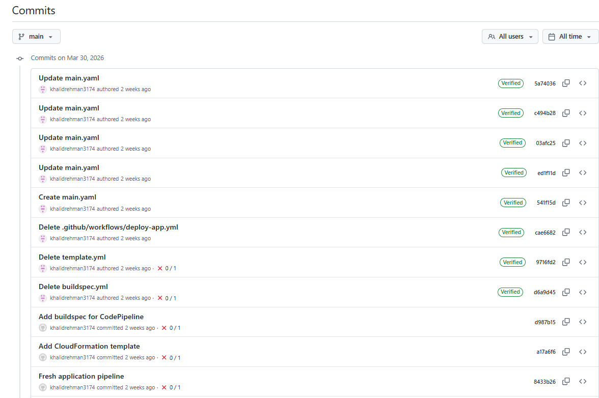
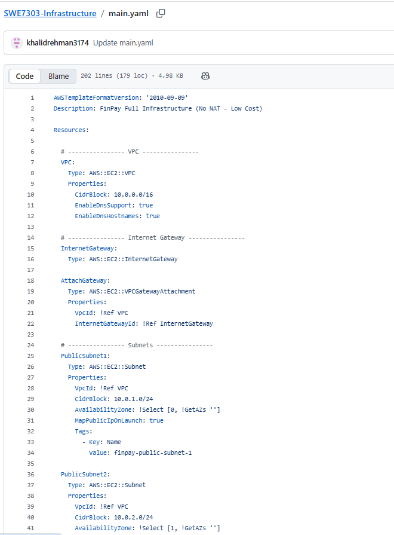
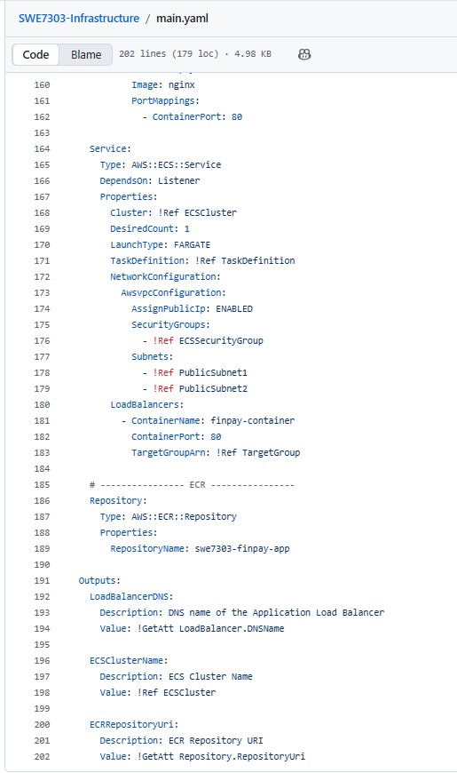

# 🏗️ Finpay Technologies — AWS Infrastructure

**Finpay Technologies — Cloud-Native DevOps Infrastructure on AWS**

[](https://aws.amazon.com)
[](https://aws.amazon.com/cloudformation/)
[](https://aws.amazon.com/fargate/)
[](https://aws.amazon.com/codepipeline/)
[](https://aws.amazon.com/rds/)
[](LICENSE)

---

## Overview

A fully automated, cloud-native AWS infrastructure for the Finpay Technologies fintech platform, provisioned entirely using **Infrastructure as Code (CloudFormation)** and deployed via a dedicated **CI/CD pipeline (AWS CodePipeline)**.

The infrastructure supports a containerised PHP application running on **ECS Fargate**, exposed via an **Application Load Balancer**, backed by **Amazon RDS MySQL**, with **Auto Scaling** validated from 1 to 4 Fargate tasks under live load testing. All resources are defined in a single CloudFormation template — no manual console clicks.

> ⚠️ Infrastructure has been decommissioned after project completion to manage AWS costs.

---

## Architecture

```
Internet
    │
    ▼
Application Load Balancer (ALB)
    │  Static DNS — distributes traffic, health checks
    ▼
ECS Fargate Service (Auto Scaling: 1–4 tasks)
    │  PHP Application Container (pulled from ECR)
    │  Multi-AZ: eu-west-2a + eu-west-2b
    ▼
Amazon RDS MySQL
    └── Users | Wallets | Transactions
```

| Layer | Service | Purpose |
|-------|---------|---------|
| IaC | AWS CloudFormation | Declarative infrastructure provisioning |
| Networking | Amazon VPC + Internet Gateway | Isolated network, public access |
| Networking | Security Groups | Least-privilege traffic control |
| Compute | Amazon ECS Fargate | Serverless container orchestration |
| Registry | Amazon ECR | Docker image storage |
| Load Balancing | Application Load Balancer | Traffic distribution and health checks |
| Database | Amazon RDS MySQL | Relational data persistence |
| Scaling | Application Auto Scaling | CPU-based target tracking (50% threshold) |
| CI/CD | AWS CodePipeline | Automated infrastructure deployment |
| Monitoring | Amazon CloudWatch | Logs, metrics, and alarms |
| Security | AWS IAM | Least-privilege roles and policies |

---

## Repository


*Infrastructure repository — main.yml CloudFormation template*


*Commit history — all infrastructure changes version controlled*

---

## CloudFormation Template (main.yml)

| | |
|---|---|
|  |  |
| *CloudFormation template — resources definition* | *CloudFormation template — continued* |

---

## CloudFormation Stack

| | |
|---|---|
|  |  |
| *CloudFormation stack — CREATE_COMPLETE* | *Stack resources — all services provisioned* |
|  |  |
| *Stack resources — continued* | *Stack events — deployment log* |

---

## CI/CD Pipelines


*Both pipelines — finpay-infra-pipeline and finpay-app-pipeline — Succeeded*

| | |
|---|---|
|  |  |
| *finpay-infra-pipeline — all stages succeeded* | *Pipeline execution history* |

---

## ECS Fargate

| | |
|---|---|
|  |  |
| *ECS Cluster — Active* | *ECS Service — running tasks* |


*ECS Tasks — Fargate launch type, Running status*

---

## Application Load Balancer

| | |
|---|---|
|  |  |
| *Load Balancer — Active* | *ALB detail — listeners and AZ configuration* |


*Target Group — healthy targets registered*

---

## Amazon RDS MySQL

| | |
|---|---|
|  |  |
| *RDS MySQL — Available* | *Database detail — engine, VPC, subnet group* |

---

## Networking (VPC, Subnets, IGW)

| | |
|---|---|
|  |  |
| *VPC — Finpay isolated network* | *Two public subnets — eu-west-2a and eu-west-2b* |


*Internet Gateway — cost-optimised alternative to NAT Gateway*

---

## Auto Scaling — Full Lifecycle Evidence

### Configuration

| | |
|---|---|
|  |  |
| *Auto Scaling policy defined on ECS service* | *Target tracking — ECSServiceAverageCPUUtilization 50%* |

### Load Test


*hey HTTP load generator — 100,000 requests fired from AWS CloudShell*

### Scale-Out

| | |
|---|---|
|  |  |
| *CloudWatch — CPU spiked to 100%* | *CloudWatch alarm triggered* |


*ECS service — scaling event initiated*


*4 Fargate tasks running — maximum scale-out achieved*


*ALB Target Group — 4 healthy containers registered and serving traffic*

### Scale-In

| | |
|---|---|
|  |  |
| *CPU utilisation returned to baseline* | *Containers scaled back down to 1* |


*Auto Scaling activity log — full scale-out and scale-in cycle recorded*

---

## Auto Scaling Results

| Metric | Result |
|--------|--------|
| Peak CPU utilisation | 100% |
| Fargate tasks at peak | 4 (max scale-out) |
| Scale-out trigger | CPU > 50% sustained |
| Scale-in cooldown | 120 seconds |
| ALB health status at peak | 4 healthy / 0 unhealthy |
| Average response time | 0.58 seconds |

---

## Key Design Decisions

**No NAT Gateway** — Public subnets with an Internet Gateway eliminate ~£25/month NAT costs for a development deployment.

**Fargate over EC2** — No server management, patching, or resizing. Per-task billing for cost control.

**Dual-pipeline architecture** — Infrastructure and application deploy independently. A code push never triggers infrastructure changes and vice versa.

**RDS MySQL over DynamoDB** — Finpay requires relational data with ACID transactions. RDS is the correct choice.

---

## Deployment

```bash
# Deploy via AWS CLI
aws cloudformation deploy \
  --template-file main.yml \
  --stack-name finpay-infra-stack \
  --capabilities CAPABILITY_NAMED_IAM \
  --region eu-west-2
```

---

## Teardown

```bash
# Delete CloudFormation stack (removes all resources)
aws cloudformation delete-stack \
  --stack-name finpay-infra-stack \
  --region eu-west-2

# Delete ECR repository
aws ecr delete-repository --repository-name finpay-app --force --region eu-west-2

# Delete pipelines
aws codepipeline delete-pipeline --name finpay-infra-pipeline
aws codepipeline delete-pipeline --name finpay-app-pipeline
```

---

## Tech Stack

`AWS CloudFormation` · `Amazon ECS Fargate` · `Amazon ECR` · `Amazon RDS MySQL` · `Application Load Balancer` · `AWS CodePipeline` · `Amazon CloudWatch` · `Amazon VPC` · `AWS IAM` · `Docker`

---

## Related Repository

🔗 [Finpay Application Repository](https://github.com/khalidrehman3174/SWE7303-Application) — PHP application, Dockerfile, buildspec.yml, CoinGecko API integration

---

## Author

**Khalid Rehman** — AWS Solutions Architect Associate | MSc Cloud Computing & Network Security, University of Bolton
Deployed in `eu-west-2` (London)
